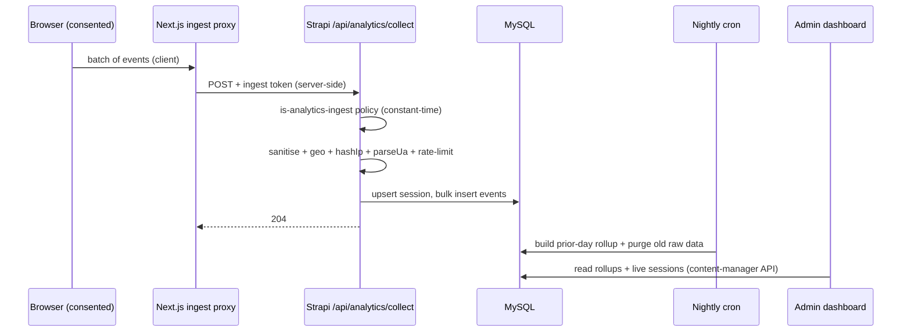
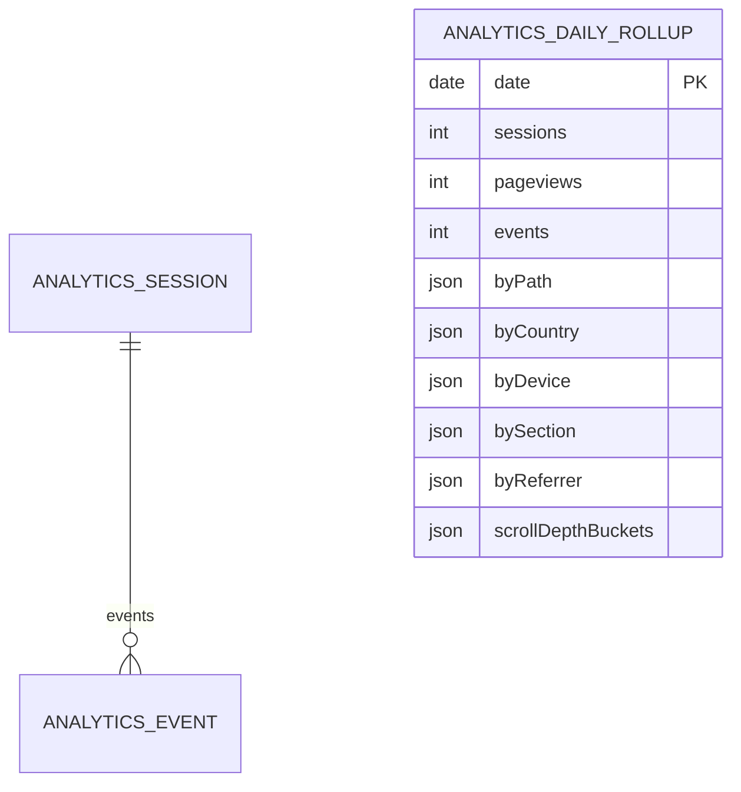

# Analytics Subsystem

> First-party, consent-gated visitor analytics: ingest pipeline, geo/UA/IP-hash/
> bot-score/rate-limit, the nightly rollup + purge cron, the Recharts admin
> dashboard, and the retention/privacy posture.
>
> Last reviewed: 2026-05-27 (commit 262ccc6)

## Contents

- [Design goals](#design-goals)
- [End-to-end flow](#end-to-end-flow)
- [Ingest pipeline](#ingest-pipeline)
- [IP anonymisation](#ip-anonymisation)
- [Geo lookup](#geo-lookup)
- [UA parsing & bot score](#ua-parsing--bot-score)
- [Validation & caps](#validation--caps)
- [Rate limiting](#rate-limiting)
- [Data model](#data-model)
- [Nightly maintenance cron](#nightly-maintenance-cron)
- [Admin dashboard](#admin-dashboard)
- [Retention & privacy](#retention--privacy)
- [Configuration](#configuration)

## Design goals

- **No raw IP at rest** — the IP is used transiently for geo, then discarded;
  only a salted, truncated hash is stored.
- **Consent-gated** — a session row is created only for `analytics` or `all`
  consent (the validator rejects anything else).
- **Offline** — geo uses the bundled `geoip-lite` dataset; no external API
  calls.
- **Visitor never blocked** — persistence errors are swallowed; the endpoint
  always returns quickly.

## End-to-end flow

The Next.js side wiring (`ANALYTICS_INGEST_URL=http://cms:1337/api/analytics/collect`,
`ANALYTICS_INGEST_TOKEN`) is in the website `deploy/docker-compose.yml`.

## Ingest pipeline

`src/api/analytics/controllers/analytics.ts` `collect(ctx)`:

1. `sanitizeBatch(ctx.request.body)` → `400` on structural failure.
2. `clientIpFrom(ctx)` reads `x-forwarded-for[0]` (forwarded by the proxy), else
   `ctx.request.ip`.
3. `ipHash = hashIp(ip, ANALYTICS_IP_SALT)` (fallback salt
   `inspire-africa-CHANGE-ME-salt` if env unset — **set the real salt**).
4. Rate-limit `collect:<ipHash>` at 240/min, burst 120 → `429` if exceeded.
5. `parseUa(user-agent)` → `{ deviceType, browser, os, botScore }`.
6. `lookupGeo(ip)` (uses raw IP transiently, **not stored**).
7. Upsert `analytics-session` by `sessionId` (create with full context, or
   bump `lastSeen`/counts/`exitPath`/`consentLevel`).
8. Insert one `analytics-event` per event, linked to the session.
9. `204`. Any persistence exception is logged and swallowed (still `204`).

## IP anonymisation

`src/utils/analytics/ip.ts`:

- `truncateIp`: IPv4 → zero the last octet (`/24`); IPv6 → keep first 3 hextets
  (`/48`); strips `::ffff:` IPv4-mapped prefix.
- `hashIp`: `SHA-256( "<truncatedIp>|<salt>" )`, hex, **truncated to 32 chars**.
- Returns `null` for empty input — and `hashIp(null)` ⇒ the session stores no
  `ipHash`.

The raw IP never reaches the database; only `ipHash` (a `private` field) is
stored, used for coarse de-duplication and rate-limiting.

## Geo lookup

`src/utils/analytics/geo.ts` (`geoip-lite`): returns `{ country (ISO-2),
region, city }`. Private/loopback ranges (10/8, 127/8, 192.168/16, 169.254/16,
172.16–31/12, `::1`, `fc00:`, `fe80:`) short-circuit to empty. Any error ⇒
empty result. No network calls.

## UA parsing & bot score

`src/utils/analytics/ua.ts` (`ua-parser-js`):

- A regex (`BOT_RE`) flags known bots/crawlers/HTTP libraries → `botScore = 1`,
  `deviceType = 'bot'`.
- Otherwise device from the parser (`mobile`/`tablet`), or `desktop` if a
  browser is recognised, or `unknown` (botScore raised to 0.5) when no browser
  is recognised. Missing UA ⇒ `unknown`, botScore 0.6.

Bot score is stored per session so dashboards can exclude bots later (the
current dashboard does not filter on it).

## Validation & caps

`src/utils/analytics/validate.ts` `sanitizeBatch`:

- `sessionId` required (≤64). `consentLevel` must be `analytics` or `all`
  (necessary-only is rejected — no row is created).
- `events` must be an array; capped at **50** per batch.
- String caps: generic 512, title 255, host 255, sectionId 128, meta 1024
  bytes. `scrollDepth` clamped 0–100. Unknown event types dropped.
- Referrers reduced to **host only** (no path/query → no PII leak).
- `occurredAt` must be ISO; else server time is used.

## Rate limiting

`src/utils/analytics/rate-limit.ts`: in-memory token bucket keyed by `ipHash`,
bounded to 20 000 keys (cleared wholesale when exceeded). Single-instance
design; the comment notes swapping for Redis if it ever scales horizontally.
Missing key ⇒ fail open.

## Data model

Three collection types, all `content-api: { visible: false }` (admin-only).
Field tables in [`content-model.md`](./content-model.md#analytics-types).

## Nightly maintenance cron

`src/crons/analytics-maintenance.ts`, wired in `config/server.ts` at rule
`'15 2 * * *'` TZ `UTC`, gated by `CRON_ENABLED` (default true).

`runAnalyticsMaintenance`:

1. `buildRollupForDate(strapi, yesterdayUTC)` — scans the prior UTC day's events
   + sessions (cap 200 000 rows/query), aggregates `byPath`, `bySection`,
   `scrollDepthBuckets` (25/50/75/100), `byCountry`, `byDevice`, `byReferrer`,
   consent counts, then **upserts** the `analytics-daily-rollup` row by `date`
   (idempotent — safe to re-run).
2. `purgeOldData(strapi)` — deletes `analytics-event` where
   `occurredAt < now - ANALYTICS_RETENTION_MONTHS` (default 14), then
   `analytics-session` where `lastSeen < cutoff` (children before parents).
   **Rollups are never purged** — kept for long-term trends.

Errors are caught and logged; the cron never throws.

## Admin dashboard

`src/admin/pages/Analytics/index.tsx`, linked from the left menu by
`src/admin/app.tsx` `register()` (position 6). It reads through the
already-authenticated **content-manager** API (so per-role read access is
enforced — see [`rbac.md`](./rbac.md)):

- `analytics-daily-rollup` (last 90, `date:desc`)
- `analytics-session` (last 100, `lastSeen:desc`) — and the pagination totals
- `analytics-event` (pageSize 1, just to read the total count)

Visualisations (Recharts): KPI cards (sessions, pageviews, tracked events,
pages/session, analytics-consent %, countries reached); a sessions/pageviews
**line** chart and events **area** chart from the rollup time-series; **donut**
charts for devices and consent level; **bar** charts for top pages, countries,
sections viewed, referrers, and scroll depth.

Fallback: before the first nightly rollup exists, breakdowns are derived from
the live session sample so the dashboard isn't empty.

## Retention & privacy

- Raw events/sessions retained `ANALYTICS_RETENTION_MONTHS` (default 14), then
  purged nightly. Rollups retained indefinitely (no PII in them).
- No raw IP stored anywhere; only the truncated salted `ipHash` (private).
- Referrers stored host-only.
- Sessions exist only for consented visitors.
- Full GDPR/PECR posture: [`security-privacy.md`](./security-privacy.md#analytics-gdpr--pecr).

## Configuration

| Env var | Purpose | Default |
|---------|---------|---------|
| `ANALYTICS_INGEST_TOKEN` | Shared secret for the ingest policy (set same on web + cms) | none (fails closed) |
| `ANALYTICS_IP_SALT` | Salt for `hashIp` | insecure fallback — **set it** |
| `ANALYTICS_RETENTION_MONTHS` | Raw-data retention window | 14 |
| `CRON_ENABLED` | Master switch for the scheduler | true |

See [`environment.md`](./environment.md).
