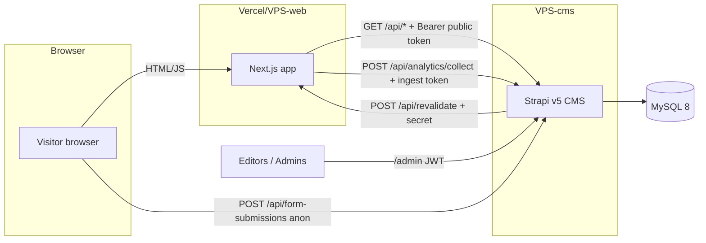
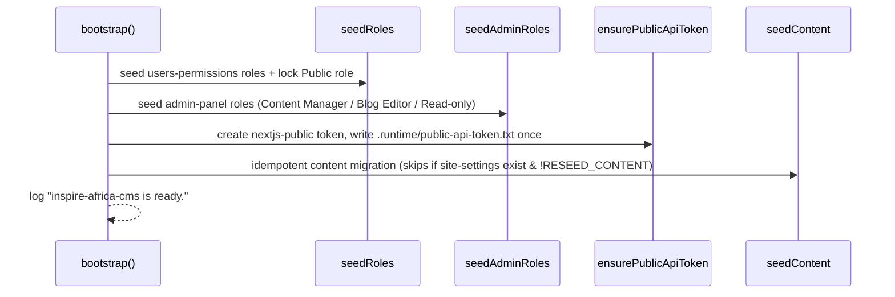
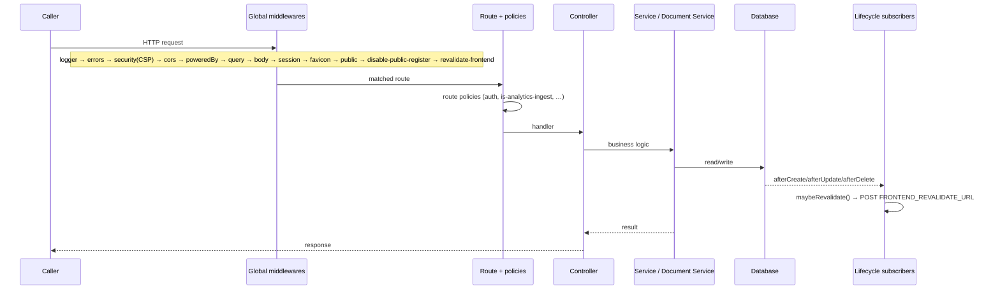

# CMS Architecture

> How the Strapi v5 application is wired: APIs, controllers/routes/services,
> policies, middlewares, bootstrap seeders, cron, admin customisation, plugins,
> and the request lifecycle.
>
> Last reviewed: 2026-05-27 (commit 262ccc6)

## Contents

- [System context](#system-context)
- [Component diagram](#component-diagram)
- [Boot sequence](#boot-sequence)
- [Request lifecycle](#request-lifecycle)
- [Middleware chain](#middleware-chain)
- [Policies](#policies)
- [Per-API structure](#per-api-structure)
- [Admin customisation](#admin-customisation)
- [Plugins](#plugins)
- [Cron](#cron)

## System context

Sources: `src/middlewares/revalidate-frontend.ts`,
`src/api/analytics/routes/analytics.ts`, `src/api/form-submission/controllers/form-submission.ts`,
website `deploy/docker-compose.yml`.

## Component diagram

```mermaid
flowchart TB
  subgraph entry[src/index.ts]
    REG["register(): registerKeycloakRoutes()"]
    BOOT["bootstrap(): seedRoles → seedAdminRoles → ensurePublicApiToken → seedContent"]
  end

  subgraph config[config/]
    SRV[server.ts host/port/url/proxy/cron]
    DBC[database.ts mysql/postgres/sqlite]
    MWC[middlewares.ts security/CORS/body + custom]
    PLG[plugins.ts upload/email/users-permissions/i18n]
    ADM[admin.ts secrets/head/flags]
    APIC[api.ts rest defaults]
  end

  subgraph api[src/api/*]
    CT["Content types (schema.json)"]
    CTRL[controllers/]
    RT[routes/ core routers]
    SVC[services/]
    ANALYTICS["analytics/ custom: POST /analytics/collect"]
    LC["blog-post lifecycles.ts (readMinutes)"]
  end

  subgraph cross[Cross-cutting]
    POL["policies/: is-public-readable, is-analytics-ingest"]
    MW["middlewares/: revalidate-frontend, disable-public-register"]
    KC["extensions/.../keycloak.ts"]
    CRON["crons/analytics-maintenance.ts"]
    UTIL["utils/analytics/: ip, geo, ua, validate, rate-limit"]
  end

  subgraph admin[src/admin]
    APP["app.tsx (brand theme + Analytics menu link)"]
    DASH["pages/Analytics (Recharts dashboard)"]
  end

  REG --> KC
  BOOT --> SVC
  SRV --> CRON
  ANALYTICS --> POL
  ANALYTICS --> UTIL
  RT --> POL
  CT --> CTRL --> SVC
  MWC --> MW
  PLG --> KC
  APP --> DASH
```

## Boot sequence

`src/index.ts` exposes the two Strapi lifecycle hooks:

- **`register({ strapi })`** — runs before plugins mount. Calls
  `registerKeycloakRoutes(strapi)` (`src/index.ts:13-15`), which adds the two
  `/api/auth/keycloak[*]` routes **only when** `KEYCLOAK_ENABLED=true`
  (`src/extensions/users-permissions/strategies/keycloak.ts:64-68`).
- **`bootstrap({ strapi })`** — runs after plugins mount. Awaits four seeders in
  a fixed order (`src/index.ts:29-34`):

Each seeder is idempotent and safe on every boot. Details:
[`seeding.md`](./seeding.md), [`rbac.md`](./rbac.md).

## Request lifecycle

The `revalidate-frontend` middleware is a pass-through that registers DB
lifecycle subscribers once at boot (`src/middlewares/revalidate-frontend.ts:26-44`);
the actual webhook fires from `afterCreate/afterUpdate/afterDelete` for the
publishable collection set, not inline in the request.

## Middleware chain

Defined in `config/middlewares.ts`, order significant:

1. `strapi::logger`
2. `strapi::errors`
3. `strapi::security` — CSP. `connect-src 'self' https:`; `img-src`/`media-src`
   allow `data:`, `blob:`, `market-assets.strapi.io`, the CDN base
   (`AWS_CDN_BASE_URL`, default `https://*.cloudfront.net`) and
   `res.cloudinary.com` (`config/middlewares.ts:11-38`).
4. `strapi::cors` — origin **allow-list** from `CORS_ORIGINS` (never `*`);
   methods `GET/POST/PUT/DELETE/PATCH/HEAD`; `credentials: true`
   (`config/middlewares.ts:39-51`).
5. `strapi::poweredBy`, `strapi::query`
6. `strapi::body` — `jsonLimit`/`formLimit`/`textLimit` = `1mb`; uploads up to
   50 MB (`config/middlewares.ts:54-65`).
7. `strapi::session`, `strapi::favicon`, `strapi::public`
8. `global::disable-public-register` — 403s `POST /admin/register-admin` once
   any admin exists (`src/middlewares/disable-public-register.ts`).
9. `global::revalidate-frontend` — registers the publish→revalidate subscriber.

## Policies

`src/policies/` (registered globally as `global::<name>`):

- **`is-public-readable`** — allows only `GET`/`HEAD`; logs+blocks anything
  else. Reusable guard for read-only routes. NOTE: the default core routers do
  **not** attach it; read/write access for those is enforced through the
  users-permissions role permissions instead (see [`rbac.md`](./rbac.md)). It is
  available for routes that opt in.
- **`is-analytics-ingest`** — constant-time (`crypto.timingSafeEqual`) bearer /
  `x-analytics-token` check against `ANALYTICS_INGEST_TOKEN`; **fails closed**
  if the token isn't configured. Attached to `POST /api/analytics/collect`
  (`src/api/analytics/routes/analytics.ts:12-15`).

## Per-API structure

Every collection/single type under `src/api/<name>/` follows the Strapi v5
convention: `content-types/<name>/schema.json` defines the model;
`routes/<name>.ts` is a `factories.createCoreRouter(...)`;
`controllers/<name>.ts` + `services/<name>.ts` are core factories unless
overridden. Overrides found in this repo:

- `api/form-submission/controllers/form-submission.ts` — custom `create`
  (server-side IP/UA capture, audit `payload` snapshot, fire-and-forget notify
  email) and `requireAdmin` gate on `find/findOne/update/delete`.
- `api/blog-post/content-types/blog-post/lifecycles.ts` — auto-computes
  `readMinutes` from the body word count (220 wpm) unless the editor set it.
- `api/analytics/` — has no model: just custom `routes` + `controllers` for the
  ingest endpoint.

The three analytics models (`analytics-session`, `analytics-event`,
`analytics-daily-rollup`) ship default routers/controllers/services but set
`content-api: { visible: false }` in their schemas, so they are **not** exposed
on the public REST API — only via the admin content-manager API.

## Admin customisation

`src/admin/app.tsx`:

- Branding: login + menu logos, favicon, browser title `INSPIRE AFRICA — CMS`,
  brand yellow `#F8BD26` theme (light + dark), Madimi One display font injected
  via Google Fonts in `bootstrap()`, English-only locale, marketing UI off
  (`tutorials: false`, `notifications.releases: false`).
- `register()` adds the **Analytics** left-menu link (position 6) pointing at
  `pages/Analytics`, with `permissions: []` (the dashboard relies on the
  content-manager API's own per-role read enforcement).

`src/admin/pages/Analytics/index.tsx` — Recharts dashboard; see
[`analytics.md`](./analytics.md#admin-dashboard).

## Plugins

`config/plugins.ts`:

- **upload** — switch on `MEDIA_PROVIDER`: `local` (default), `aws-s3`
  (CloudFront `baseUrl`, ACL, signed-URL expiry), or `cloudinary`.
- **email** — `EMAIL_PROVIDER` (default `sendmail`); SendGrid when set to
  `sendgrid`; default from/reply-to addresses.
- **users-permissions** — JWT `expiresIn: 7d`, `jwtSecret` from `JWT_SECRET`,
  default social providers left off (Keycloak is the custom strategy).
- **i18n** — built-in in v5 (no install).

## Cron

`config/server.ts` registers one task under `cron.tasks`:
`analyticsMaintenance` at rule `'15 2 * * *'` TZ `UTC`, calling
`runAnalyticsMaintenance(strapi)` from `src/crons/analytics-maintenance.ts`.
The whole scheduler is gated by `CRON_ENABLED` (default `true`). See
[`analytics.md`](./analytics.md#nightly-maintenance-cron).
