# Content Model & ERD

> Every content type and component in the CMS, with field tables, relations,
> PII / `private` markers, and the analytics privacy posture.
>
> Last reviewed: 2026-05-27 (commit 262ccc6)

## Contents

- [Overview](#overview)
- [Entity-relationship diagram](#entity-relationship-diagram)
- [Collection types](#collection-types)
  - [page](#page) · [blog-post](#blog-post) · [corridor](#corridor) · [author](#author) · [tag](#tag) · [legal-document](#legal-document) · [job-posting](#job-posting) · [form-definition](#form-definition) · [form-submission-pii](#form-submission-pii) · [candidate-pii](#candidate-pii)
- [Single types](#single-types)
  - [site-setting](#site-setting) · [navigation](#navigation) · [design-token](#design-token)
- [Analytics types](#analytics-types)
- [Components](#components)
- [PII & privacy summary](#pii--privacy-summary)

## Overview

| API ID | Kind | Draft&Publish | i18n | Public API | Notes |
|--------|------|:---:|:---:|:---:|-------|
| `site-setting` | single | no | yes | read | brand/contact/SEO defaults |
| `design-token` | single | no | no | read | CSS variables |
| `navigation` | single | no | yes | read | header/footer/legal links |
| `page` | collection | **yes** | yes | read (published) | Dynamic Zone of sections |
| `corridor` | collection | **yes** | yes | read | destination markets |
| `blog-post` | collection | **yes** | yes | read (published) | Dynamic Zone body |
| `tag` | collection | no | no | read | labels |
| `author` | collection | no | no | read | by-lines |
| `legal-document` | collection | **yes** | yes | read (published) | privacy/cookies/terms/modern-slavery |
| `job-posting` | collection | **yes** | no | read (published) | vacancies |
| `form-definition` | collection | no | yes | read | editable form copy |
| `form-submission` | collection | no | no | **create only** | PII; admin GET/PUT/DELETE |
| `candidate` | collection | no | no | **none** | PII; admin-only |
| `analytics-session` | collection | no | no | **none** (`content-api: false`) | no raw IP |
| `analytics-event` | collection | no | no | **none** (`content-api: false`) | no PII |
| `analytics-daily-rollup` | collection | no | no | **none** (`content-api: false`) | pre-aggregated |

"Public API" reflects the **seeded** permissions (`src/bootstrap/seed-roles.ts`)
and per-schema `content-api` visibility, not the route defaults. See
[`rbac.md`](./rbac.md) and [`api-reference.md`](./api-reference.md).

## Entity-relationship diagram

```mermaid
erDiagram
  PAGE ||--o{ SEO : "seo (component)"
  PAGE ||--o{ SECTIONS : "sections (dynamiczone)"
  BLOG_POST }o--|| AUTHOR : "author (manyToOne)"
  BLOG_POST }o--o{ TAG : "tags (manyToMany)"
  BLOG_POST ||--o{ SEO : "seo (component)"
  BLOG_POST ||--o{ BODY_BLOCKS : "body (dynamiczone)"
  AUTHOR ||--o{ SOCIAL_LINK : "socialLinks (component)"
  JOB_POSTING }o--o{ TAG : "tags (manyToMany)"
  JOB_POSTING ||--o{ SEO : "seo (component)"
  LEGAL_DOCUMENT ||--o{ SEO : "seo (component)"
  LEGAL_DOCUMENT ||--o{ TOC_ANCHOR : "tocAnchors (component)"
  LEGAL_DOCUMENT ||--o{ BODY_BLOCKS : "body (dynamiczone)"
  CANDIDATE }o--o{ TAG : "skillTags (manyToMany)"
  CANDIDATE }o--|| UP_USER : "assignedAgent (manyToOne, private)"
  CORRIDOR }o--o{ FLAG_MEDIA : "flagIcon (media)"
  CORRIDORS_MARQUEE }o--o{ CORRIDOR : "corridors (oneToMany)"
  INSIGHTS_STRIP }o--|| TAG : "filterTag (oneToOne)"
  SITE_SETTING ||--o{ POSTAL_ADDRESS : "companyAddress (component)"
  SITE_SETTING ||--o{ SOCIAL_LINK : "socialLinks (component)"
  SITE_SETTING ||--o{ SEO : "defaultSeo (component)"
  NAVIGATION ||--o{ NAV_LINK : "headerLinks/legalLinks (component)"
  NAVIGATION ||--o{ FOOTER_COLUMN : "footerColumns (component)"
  FOOTER_COLUMN ||--o{ NAV_LINK : "links (component)"
  DESIGN_TOKEN ||--o{ COLOR_PAIR : "text/background/... (component)"
  ANALYTICS_SESSION ||--o{ ANALYTICS_EVENT : "events (oneToMany)"
  FORM_SUBMISSION }o--|| FORM_DEFINITION : "by formKey (logical, no FK)"
```

Note: `form-submission` → `form-definition` is a *logical* link by `formKey`
(resolved at runtime in the controller), not a Strapi relation.

## Collection types

### page

`src/api/page/content-types/page/schema.json`. Draft&Publish, i18n.

| Field | Type | Required | Notes |
|-------|------|:---:|-------|
| `title` | string | yes | localized |
| `slug` | uid (target `title`) | yes | not localized |
| `seo` | component `shared.seo` | no | localized |
| `sections` | dynamiczone | no | components: hero, audiences, corridors-marquee, numbers, testimonials, feature-list, process-list, step-cards, insights-strip, form-block, final-cta |

### blog-post

`src/api/blog-post/.../schema.json`. Draft&Publish, i18n. Lifecycle auto-sets `readMinutes`.

| Field | Type | Required | Notes |
|-------|------|:---:|-------|
| `title` | string (≤200) | yes | localized |
| `slug` | uid (`title`) | yes | not localized |
| `excerpt` | text (≤320) | yes | localized |
| `category` | enum | yes | Ethical Recruitment / Policy & Markets / Development Economics / Worker Stories / Employer Stories / Government Partnerships / Platform Updates |
| `heroImage` | media (image) | yes | |
| `heroAlt` | string | yes | localized |
| `readMinutes` | integer 1–60 | no | auto-computed by lifecycle from body word count (220 wpm) |
| `author` | relation manyToOne → author | no | inversedBy `blog_posts` |
| `tags` | relation manyToMany → tag | no | inversedBy `blog_posts` |
| `body` | dynamiczone | no | blocks: lede, heading, paragraph, list, callout, quote, image, video |
| `seo` | component `shared.seo` | no | localized |

### corridor

`src/api/corridor/.../schema.json`. Draft&Publish, i18n.

| Field | Type | Required | Notes |
|-------|------|:---:|-------|
| `country` | string | yes | **unique**, not localized (upsert key in seed) |
| `displayName` | string | yes | localized |
| `sectors` | string | yes | e.g. `Healthcare · Care`; localized |
| `flagIcon` | media (image) | no | |
| `order` | integer | no | default 0 |

### author

`src/api/author/.../schema.json`. No Draft&Publish.

| Field | Type | Required | Notes |
|-------|------|:---:|-------|
| `name` | string | yes | |
| `slug` | uid (`name`) | yes | |
| `role` | string | no | |
| `avatar` | media (image) | no | |
| `bio` | blocks | no | |
| `socialLinks` | component `shared.social-link` (repeatable) | no | |
| `blog_posts` | relation oneToMany → blog-post | – | mappedBy `author` |

### tag

`src/api/tag/.../schema.json`. No Draft&Publish.

| Field | Type | Required | Notes |
|-------|------|:---:|-------|
| `name` | string | yes | **unique** |
| `slug` | uid (`name`) | yes | |
| `color` | string (hex regex) | no | default `#F8BD26` |
| `blog_posts` | relation manyToMany → blog-post | – | mappedBy `tags` |

### legal-document

`src/api/legal-document/.../schema.json`. Draft&Publish, i18n.

| Field | Type | Required | Notes |
|-------|------|:---:|-------|
| `slug` | enum | yes | **unique**, not localized: privacy / cookies / terms / modern-slavery |
| `title` | string | yes | localized |
| `eyebrow` | string | no | default `Legal`; localized |
| `headingHtml` | text | yes | localized (rendered as HTML) |
| `lede` | text | yes | localized |
| `version` | string | yes | default `1.0` |
| `lastUpdated` | date | yes | |
| `controllerName` | string | no | |
| `tocAnchors` | component `blocks.toc-anchor` (repeatable) | no | localized |
| `body` | dynamiczone | no | blocks: heading, paragraph, list, callout, table, quote |
| `seo` | component `shared.seo` | no | localized |

### job-posting

`src/api/job-posting/.../schema.json`. Draft&Publish, **no i18n**.

| Field | Type | Required | Notes |
|-------|------|:---:|-------|
| `title` | string (≤200) | yes | |
| `slug` | uid (`title`) | yes | |
| `description` | blocks | yes | |
| `destinationCountry` | enum | yes | UK/EU/USA/Canada/Australia/Mauritius/Saudi Arabia |
| `destinationCity` | string | no | |
| `sector` | enum | yes | Healthcare…Other (10) |
| `salaryMin` / `salaryMax` | decimal | no | |
| `salaryCurrency` | enum | no | GBP default |
| `salaryPeriod` | enum | no | hour/month/year, default year |
| `requirements` | blocks | yes | |
| `benefits` | blocks | no | |
| `closingDate` | date | yes | |
| `status` | enum | yes | Draft/Published/Closed/Filled, default Draft |
| `applicationLink` | string | no | |
| `vacancies` | integer ≥1 | no | default 1 |
| `tags` | relation manyToMany → tag | no | |
| `seo` | component `shared.seo` | no | |

### form-definition

`src/api/form-definition/.../schema.json`. No Draft&Publish, i18n. Editable form copy that replaces hard-coded labels in the website forms.

| Field | Type | Required | Notes |
|-------|------|:---:|-------|
| `formKey` | enum | yes | **unique**, not localized: contact / employers / governments |
| `title` | string | yes | localized |
| `lede` | text | yes | localized |
| `fields` | json | yes | array of `{ name, label, type, required, options?, placeholder?, helpText? }`; localized |
| `submitLabel` | string | yes | default `Send message`; localized |
| `successMessage` | text | yes | localized |
| `notifyEmail` | email | yes | where submissions are emailed |

### form-submission (PII)

`src/api/form-submission/.../schema.json`. No Draft&Publish. **Contains PII.**
Public can `POST`; only `inspire-admin` can `GET/PUT/DELETE` (controller-enforced).

| Field | Type | Required | `private` | Notes |
|-------|------|:---:|:---:|-------|
| `formKey` | enum | yes | | contact/employers/governments |
| `payload` | json | yes | **yes** | full submission snapshot |
| `audience` | string | no | | |
| `firstName` | string | no | **yes** | |
| `lastName` | string | no | **yes** | |
| `email` | email | yes | **yes** | |
| `phone` | string | no | **yes** | |
| `organisation` | string | no | | |
| `country` | string | no | | |
| `message` | text | no | **yes** | |
| `ipAddress` | string | no | **yes** | captured server-side in controller |
| `userAgent` | string | no | **yes** | captured server-side |
| `recaptchaScore` | decimal | no | **yes** | |
| `status` | enum | yes | | New/Acknowledged/InProgress/Closed/Spam |
| `processedAt` | datetime | no | **yes** | |

`private` fields are excluded from REST responses by Strapi even for callers
that can read the type.

### candidate (PII)

`src/api/candidate/.../schema.json`. No Draft&Publish. **PII — never exposed on
the public API; read access restricted to `inspire-admin`** (schema description
+ `ADMIN_ONLY` in `seed-roles.ts`).

| Field | Type | Required | `private` | Notes |
|-------|------|:---:|:---:|-------|
| `fullName` | string | yes | | |
| `email` | email | yes | **yes** | unique |
| `phone` | string | no | **yes** | |
| `countryOfOrigin` | string | no | | |
| `currentLocation` | string | no | | |
| `resume` | media (file) | no | **yes** | |
| `portfolio` | media (file/image, multiple) | no | **yes** | |
| `skillTags` | relation manyToMany → tag | no | | |
| `sectors` | json | no | | array of sector keys |
| `yearsExperience` | integer 0–60 | no | | |
| `languageProficiency` | json | no | | `[{ language, level }]` |
| `applicationStatus` | enum | yes | | New…Rejected (8), default New |
| `assignedAgent` | relation manyToOne → users-permissions.user | no | **yes** | |
| `notes` | blocks | no | **yes** | |
| `consentMarketing` | boolean | no | | default false |
| `consentDataSharing` | boolean | yes | | default false |
| `consentTimestamp` | datetime | no | | |

## Single types

### site-setting

`src/api/site-setting/.../schema.json`. i18n. Marker doc the seeder checks
(`name = "INSPIRE AFRICA"`).

Key fields: `name`*, `legalName`*, `tagline`*, `description`* (text ≤280),
`baseUrl`*, `locale`, `companyNumber`, `companyAddress` (`shared.postal-address`),
`contactUkPhone`, `contactAfricaPhone`, `contactEmail`, `contactLegalEmail`,
`contactSpeakupEmail`, `socialLinks` (`shared.social-link` repeatable),
`communityBaseUrl`, `logo`/`favicon`/`defaultOgImage` (media),
`defaultSeo` (`shared.seo`). (* = required.)

### navigation

`src/api/navigation/.../schema.json`. i18n. `headerLinks` + `legalLinks`
(repeatable `shared.nav-link`), `footerColumns` (repeatable
`shared.footer-column`, each with nested `links`).

### design-token

`src/api/design-token/.../schema.json`. No i18n. `brandYellow` (hex),
eight `tokens.color-pair` components (`text`, `background`, `surface`,
`surfaceAlt`, `accentInk`, `accentDisplay`, `line`, `lineStrong`),
`fontDisplay`/`fontBody`, `breakpoints` (json), `shadowCard`/`shadowHover`.

## Analytics types

All three set `content-api: { visible: false }` (admin-only). Privacy posture
documented in [`analytics.md`](./analytics.md) and
[`security-privacy.md`](./security-privacy.md).

### analytics-session

`src/api/analytics-session/.../schema.json`. One row per consented session.

Fields: `sessionId`* (unique, ≤64), `firstSeen`, `lastSeen`, `pageviewCount`,
`eventCount`, `entryPath`, `exitPath`, `referrerHost`, `utmSource/Medium/Campaign`,
`country` (ISO-2), `region`, `city`, `deviceType` (enum mobile/tablet/desktop/bot/unknown),
`browser`, `os`, `consentLevel` (enum necessary/analytics/all), `botScore` (float),
**`ipHash` (string, `private`)** — salted/truncated hash; **raw IP never stored**,
`events` (oneToMany → analytics-event).

### analytics-event

`src/api/analytics-event/.../schema.json`. One row per interaction. No PII.

Fields: `type`* (enum: pageview/click/scroll_depth/section_view/outbound_click/
form_start/form_submit/session_end), `path`, `pageTitle`, `referrer`, `target`,
`sectionId`, `scrollDepth` (0–100), `occurredAt`, `meta` (json),
`session` (manyToOne → analytics-session, inversedBy `events`).

### analytics-daily-rollup

`src/api/analytics-daily-rollup/.../schema.json`. One row per UTC day.

Fields: `date`* (unique), `sessions`, `pageviews`, `events`, `byPath`,
`byCountry`, `byDevice`, `bySection`, `byReferrer`, `scrollDepthBuckets`,
`consentAnalytics`, `consentAll` (all counts/json).

## Components

Components live in `src/components/<group>/<name>.json`. Groups:

**`sections/`** (used in Page Dynamic Zone) — `hero` (watermark, eyebrow,
headingHtml, lede, `ctas` [shared.cta ≤3], `photo` media + `photoUrl` string
override + `photoAlt`, captions, `centered`, `priority`); `audiences` (eyebrow,
headingHtml, lede, `cards` [cards.audience-card]); `corridors-marquee` (`label`,
`corridors` relation oneToMany→corridor); `numbers` (`stats` [cards.stat]);
`testimonials` (`items` [cards.testimonial]); `feature-list` (`tone`,
`items` [cards.feature-item]); `process-list` (`tone`, `steps` [cards.process-step]);
`step-cards` (`items` [cards.step-card]); `insights-strip` (eyebrow, headingHtml,
lede, `limit`, `filterTag` oneToOne→tag, ctaLabel/ctaHref); `form-block`
(`formKey`, headingHtml, `anchorId`); `final-cta` (eyebrow, headingHtml, lede,
`primaryCta` [shared.cta required], `secondaryLinks` [shared.nav-link]).

**`blocks/`** (used in blog-post / legal-document body) — `lede` (text);
`heading` (text, `level` h2/h3/h4, anchorId); `paragraph` (`text` blocks);
`list` (`ordered`, `items` json string array); `callout` (title, text);
`quote` (text, attribution); `image` (media, alt, caption, fullBleed);
`video` (url, title, poster, autoplay); `table` (caption, `headers` json,
`rows` json 2D); `toc-anchor` (label, anchorId).

**`cards/`** — `audience-card` (number, title, body, `photo` media, photoAlt,
tag, ctaLabel, ctaHref, isPrimary); `feature-item` (marker, title, body, isBad);
`process-step` (title, body); `step-card` (marker, title, body);
`stat` (value, label, order); `testimonial` (quote, name, role, `flag` enum,
`photo` media, photoAlt).

**`shared/`** — `cta` (label, href, `variant` primary/ghost/dark, withArrow,
isExternal, utmSource/Medium/Campaign); `nav-link` (label, href, isExternal,
isCta, order, ariaLabel); `footer-column` (heading, `links` [nav-link], order);
`social-link` (`platform` enum, label, url, handle, iconKey, order);
`postal-address` (label, street, city, region, postalCode, country, phone, email);
`seo` (metaTitle ≤70, metaDescription ≤160, metaKeywords, metaRobots, canonicalUrl,
`ogImage` media, `ogType` enum, `structuredDataJson` json).

**`tokens/`** — `color-pair` (name, `light`, `dark` — both CSS-colour regex).

Generated TS types for all of the above are in
`types/generated/components.d.ts` and `types/generated/contentTypes.d.ts`.

## PII & privacy summary

| Where | PII / sensitive fields | Protection |
|-------|------------------------|------------|
| `candidate` | email, phone, resume, portfolio, assignedAgent, notes | type has **no** public API permission (admin-only); listed fields `private` |
| `form-submission` | firstName, lastName, email, phone, message, ipAddress, userAgent, payload, recaptchaScore, processedAt | public **create only**; GET/PUT/DELETE require `inspire-admin`; listed fields `private` |
| `analytics-session` | `ipHash` (already anonymised) | `private`; **raw IP never stored**; `content-api: false` |
| `analytics-event` | none (host-only referrers, no IP) | `content-api: false` |

Full GDPR/PECR posture: [`security-privacy.md`](./security-privacy.md).
