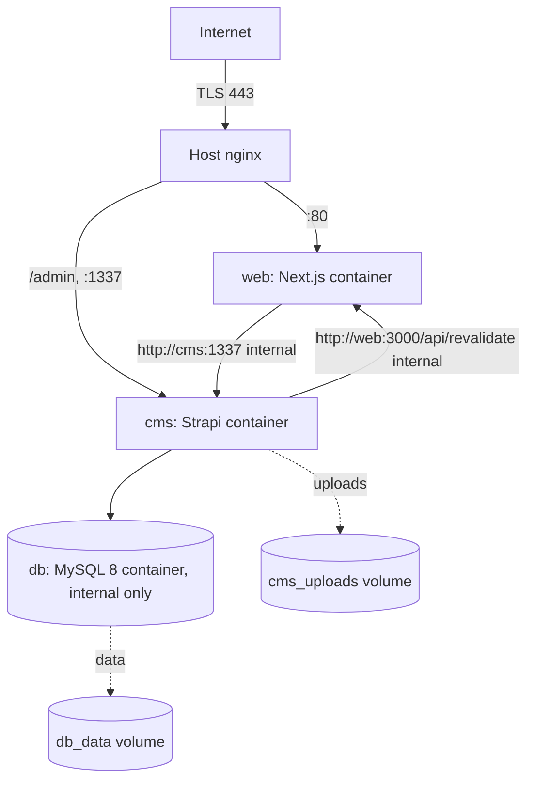
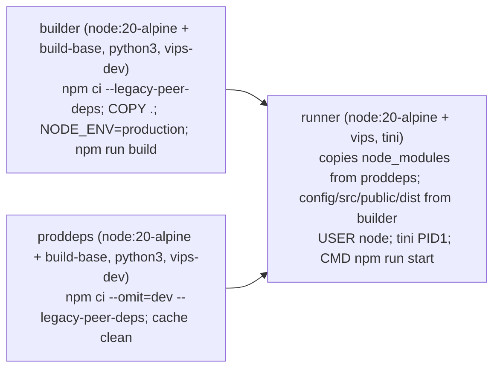

# Deployment & Build

> The authoritative production deployment: Dockerfile stages, the GHCR
> workflow, the on-server build fallback for the private package, RESEED deploy
> steps, and the revalidate webhook to the web app.
>
> Last reviewed: 2026-05-27 (commit 262ccc6)

## Contents

- [Production topology](#production-topology)
- [Dockerfile stages](#dockerfile-stages)
- [GHCR build workflow](#ghcr-build-workflow)
- [On-server build fallback (private package)](#on-server-build-fallback-private-package)
- [The compose stack](#the-compose-stack)
- [First-boot steps](#first-boot-steps)
- [Deploying an update](#deploying-an-update)
- [RESEED during deploy](#reseed-during-deploy)
- [The revalidate webhook](#the-revalidate-webhook)
- [Alternative: Render](#alternative-render)

## Production topology

Runs on a **Contabo VPS** at `/opt/inspire-africa` as a single `docker compose`
stack, behind the **host's nginx** (TLS termination). SSH is on port **2021**
with 2FA. The CMS admin is reachable at `inspireafricans.com/admin`.



- `db` MySQL 8 — internal only, no host port; named volume `db_data`.
- `cms` Strapi — publishes `1337`; uploads on named volume `cms_uploads`
  (`MEDIA_PROVIDER=local`).
- `web` Next.js — publishes `80` (mapped to container `3000`).
- The website talks to the CMS over the internal docker network
  (`http://cms:1337`); the CMS revalidates the site at `http://web:3000`.

> SHARED VPS — **never** run global `docker prune` / `docker compose down`
> across the host; only act on this stack's services. See
> [`operations.md`](./operations.md).

Source: website `deploy/docker-compose.yml`, `deploy/.env.production.example`,
deployment memory.

## Dockerfile stages

`Dockerfile` — three stages so the runtime ships production deps only:



- `builder` compiles the admin bundle + TS config (needs dev tooling).
- `proddeps` installs a pruned dependency tree.
- `runner` assembles a lean image, runs as non-root `node`, uses `tini` as PID 1
  for signal handling, ensures `/app/.tmp` + `/app/public/uploads` exist, and
  exposes `1337`. `vips` (libvips for `sharp`) is in the runtime.

## GHCR build workflow

`.github/workflows/docker-publish.yml`:

- Trigger: push to `main` **except** `**.md`, `docs/**`, `render.yaml`
  (`paths-ignore`), plus `workflow_dispatch`.
- Builds + pushes to `ghcr.io/<repo>` (i.e.
  `ghcr.io/bahindiemma/inspire-africa-cms`) with tags `latest` and
  `sha-<short>`, using GHA build cache.

> **A docs-only push (this set) will NOT trigger an image rebuild** because of
> `paths-ignore: docs/**` and `**.md`. Intended.

## On-server build fallback (private package)

The GHCR package is **private**. If the VPS can't authenticate to pull
`ghcr.io/bahindiemma/inspire-africa-cms:latest`, build it on-host from a clone
instead of pulling:

```bash
# On the VPS, from a checkout of inspire-africa-cms:
docker build -t ghcr.io/bahindiemma/inspire-africa-cms:latest .
# Then bring the stack up using the local image (compose references :latest):
docker compose -f /opt/inspire-africa/docker-compose.yml up -d cms
```

Either authenticate the host to GHCR (`docker login ghcr.io` with a PAT that has
`read:packages`) so `docker compose pull` works, **or** keep building on-host.
On-host builds need the same `vips`/`build-base` toolchain the Dockerfile
installs (handled inside the build stages).

## The compose stack

The compose file lives with the **website** repo (`deploy/docker-compose.yml`)
and orchestrates all three services. The `cms` service env (from
`/opt/inspire-africa/.env`) is documented in [`environment.md`](./environment.md).
Key CMS settings there: `DATABASE_CLIENT=mysql`, `DATABASE_HOST=db`,
`MEDIA_PROVIDER=local`, `IS_PROXIED=false`,
`FRONTEND_REVALIDATE_URL=http://web:3000/api/revalidate`, the analytics
secrets, and the Strapi secrets.

## First-boot steps

1. `docker compose up -d db` and wait for it to pass its healthcheck.
2. `docker compose up -d cms` — first boot creates schema + runs the four
   bootstrap seeders (roles, admin roles, public token, content). Watch logs
   for `[bootstrap] inspire-africa-cms is ready.`
3. Open `https://inspireafricans.com/admin` → create the **super-admin**.
4. Confirm Settings → Users & Permissions → Roles → Public has only
   `form-submission.create`.
5. Settings → API Tokens: a read-only `nextjs-public` token already exists
   (auto-seeded; plaintext was written once to `.runtime/public-api-token.txt`
   inside the container). Either read it from there or create a fresh one, then
   set it as `STRAPI_PUBLIC_TOKEN` in `/opt/inspire-africa/.env`.
6. `docker compose up -d web` to (re)start the site with the token.

## Deploying an update

```bash
# If pulling from GHCR (host authenticated):
docker compose -f /opt/inspire-africa/docker-compose.yml pull cms
docker compose -f /opt/inspire-africa/docker-compose.yml up -d cms
# If building on-host (private package, no pull):
docker build -t ghcr.io/bahindiemma/inspire-africa-cms:latest /path/to/clone
docker compose -f /opt/inspire-africa/docker-compose.yml up -d --force-recreate cms
```

Schema migrations run automatically on boot. Only the `cms` service needs
recreating for CMS changes; leave `db` and `web` running.

## RESEED during deploy

Content updates that live in `seed-content.ts` are applied with a **one-shot**
`RESEED_CONTENT=true` boot, then removed. Full procedure + warnings:
[`seeding.md`](./seeding.md#running-a-reseed-safely).

```bash
RESEED_CONTENT=true docker compose up -d --force-recreate cms
docker compose logs -f cms | grep seed-content   # wait for "DONE."
docker compose up -d --force-recreate cms          # without RESEED_CONTENT
```

## The revalidate webhook

On every create/update/delete of a publishable type, the CMS POSTs
`{ collection, slug, uid }` to `FRONTEND_REVALIDATE_URL?secret=REVALIDATE_SECRET`
(`src/middlewares/revalidate-frontend.ts`). Revalidatable types: page,
blog-post, legal-document, job-posting, corridor, site-setting, design-token,
navigation, form-definition. The Next.js handler verifies the secret and calls
`revalidateTag`/`revalidatePath`. In production this is an **internal** call
(`http://web:3000/api/revalidate`), so it never leaves the docker network.
Failures are logged and non-fatal. Frontend handler details:
[`frontend-integration.md`](./frontend-integration.md).

## Alternative: Render

A `render.yaml` blueprint is included for a Render-hosted deployment with an
external managed MySQL (or Render Postgres). It is **not** the production path
but remains a valid alternative scaffold. The pre-existing
[`docs/deployment.md` history / `api-contract.md`] describe that Render/AWS
reference architecture; for the live environment, this document is
authoritative.
