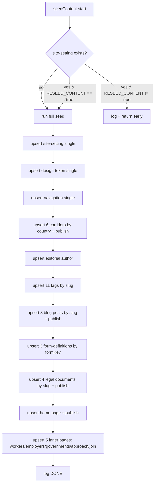

# Content Seeding & RESEED Guide

> How the four bootstrap seeders work, what each does, and how to safely use the
> `RESEED_CONTENT` mechanism.
>
> Last reviewed: 2026-05-27 (commit 262ccc6)

## Contents

- [The four seeders](#the-four-seeders)
- [seed-content.ts in detail](#seed-contentts-in-detail)
- [The RESEED_CONTENT mechanism](#the-reseed_content-mechanism)
- [Running a reseed safely](#running-a-reseed-safely)
- [What gets seeded](#what-gets-seeded)
- [seed:roles script](#seedroles-script)

## The four seeders

`src/index.ts` `bootstrap()` runs these in order on **every boot**
(`src/index.ts:29-34`). All are idempotent.

| Order | Seeder | File | Effect |
|------|--------|------|--------|
| 1 | `seedRoles` | `src/bootstrap/seed-roles.ts` | Users-permissions (API consumer) roles + locks Public role |
| 2 | `seedAdminRoles` | `src/bootstrap/seed-admin-roles.ts` | Admin-panel (CMS editor) roles |
| 3 | `ensurePublicApiToken` | `src/bootstrap/ensure-public-api-token.ts` | Creates the `nextjs-public` read-only token once |
| 4 | `seedContent` | `src/bootstrap/seed-content.ts` | Migrates all static site content into Strapi |

Seeders 1–2 are covered in [`rbac.md`](./rbac.md). Seeder 3 is covered in
[`security-privacy.md`](./security-privacy.md#public-api-token) and below.

### ensurePublicApiToken

`src/bootstrap/ensure-public-api-token.ts`:

- Looks up an admin API token named `nextjs-public`. If it exists, logs and
  returns (idempotent).
- Otherwise creates a **read-only**, non-expiring token and writes its
  **plaintext** to `.runtime/public-api-token.txt` with mode `0600`.
- Strapi only returns a token's plaintext at creation time (it stores a salted
  hash afterwards), so this captures it once for the Next.js app to pick up.
  The Next.js app uses the env var `STRAPI_PUBLIC_TOKEN` (or this file).

> `.runtime/` is git-ignored and docker-ignored. Treat that file as a secret —
> see [`security-privacy.md`](./security-privacy.md).

## seed-content.ts in detail

`src/bootstrap/seed-content.ts` migrates **every static value from the Next.js
app** into Strapi. It uses the Strapi v5 **Document Service**
(`strapi.documents(uid)`), not the v4 entity service.



Key behaviours (all from `src/bootstrap/seed-content.ts`):

- **Upsert by stable key**, never delete: corridors by `country`, tags + blog +
  legal + pages by `slug`, forms by `formKey`. Existing docs are **patched**,
  not duplicated (lines 135-143, 161-168, 230-252, 302-329, 413-423).
- **Single types** use a `upsertSingle` helper (create-if-missing-then-update),
  because the Document Service `update` only patches existing docs
  (lines 32-39).
- Draft&Publish types are **published** after create (`.publish({ documentId })`).
- Every write is wrapped in `.catch(...)` that logs a warning and continues, so
  a single failing document never aborts the whole seed.
- The corridor list seeds **6** entries (UK, EU, USA, Canada, Australia,
  Saudi Arabia) although the log says "7 corridors upserted" (line 144) and the
  website copy references 7 — see [`known-issues.md`](./known-issues.md).
- Blog/legal **bodies are abbreviated stubs**; the comment notes full text is
  pasted in via the admin once editors are comfortable (lines 171-175, 312).

## The RESEED_CONTENT mechanism

The guard (`src/bootstrap/seed-content.ts:18-25`):

```ts
const force = process.env.RESEED_CONTENT === 'true';
const existingSettings = await strapi.documents('api::site-setting.site-setting').findFirst({});
if (existingSettings && !force) {
  // log "Site Settings already present — skipping seed. Set RESEED_CONTENT=true to force."
  return;
}
```

So:

- **Fresh DB** (no site-setting): full seed runs.
- **Existing DB, `RESEED_CONTENT` unset/false**: seed is **skipped entirely**.
  This is the normal production state — boots are fast and never touch content.
- **Existing DB, `RESEED_CONTENT=true`**: full seed runs again, **upserting**
  (patching) all the documents above. It does **not** delete anything, so
  editor-created documents and any fields not in the seed are untouched; but
  fields that the seed *does* set will be **overwritten back to seed values**
  for the seeded documents (e.g. the home page sections revert to the seed
  layout).

## Running a reseed safely

When to reseed: you've shipped new seed content (new pages/sections/copy) and
want it applied to an existing environment, or a seeded document was corrupted.

```bash
# Production (docker compose on the VPS, /opt/inspire-africa):
# 1. Back up the DB first (see operations.md).
# 2. Set RESEED_CONTENT=true for one boot and restart ONLY the cms service.
RESEED_CONTENT=true docker compose up -d --force-recreate cms
# 3. Watch the logs for "[seed-content] DONE." then UNSET it again:
docker compose logs -f cms | grep seed-content
# 4. Remove RESEED_CONTENT (or set false) and recreate so it won't reseed on
#    the next routine restart.
docker compose up -d --force-recreate cms
```

> NEVER leave `RESEED_CONTENT=true` set permanently — every restart would
> revert seeded documents (e.g. the home page) to seed defaults, clobbering
> editor changes to those documents. It is a one-shot switch.

To **wipe and start over** (dev only): delete `.tmp/data.db` (SQLite) or
truncate the relevant tables (MySQL), then boot — the fresh-DB path runs.

## What gets seeded

| Group | Count | Upsert key | Published? |
|-------|------:|-----------|:---:|
| Site Settings | 1 (single) | n/a | n/a |
| Design Tokens | 1 (single) | n/a | n/a |
| Navigation | 1 (single) | n/a | n/a |
| Corridors | 6 | `country` | yes |
| Author | 1 (`editorial-desk`) | `slug` | n/a |
| Tags | 11 | `slug` | n/a |
| Blog posts | 3 | `slug` | yes |
| Form definitions | 3 (contact/employers/governments) | `formKey` | n/a |
| Legal documents | 4 (privacy/cookies/terms/modern-slavery) | `slug` | yes |
| Pages | 6 (home + workers/employers/governments/approach/join) | `slug` | yes |

Note: the website also references a `contact` page; the seeder does **not**
create a `contact` Page document (only the `contact` form-definition). See
[`known-issues.md`](./known-issues.md).

## seed:roles script

`npm run seed:roles` runs `strapi exec ts-node src/bootstrap/seed-roles.ts`
(`package.json:11`). Use it to re-apply the users-permissions roles without a
full reboot (e.g. after editing the role spec). It does **not** run
`seedAdminRoles` or `seedContent`. See [`rbac.md`](./rbac.md).
